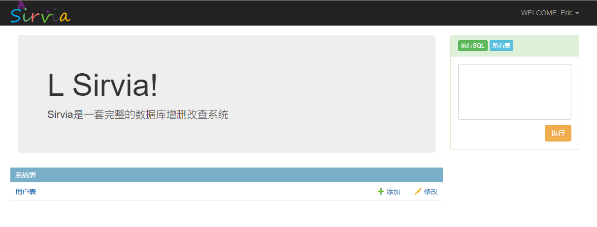
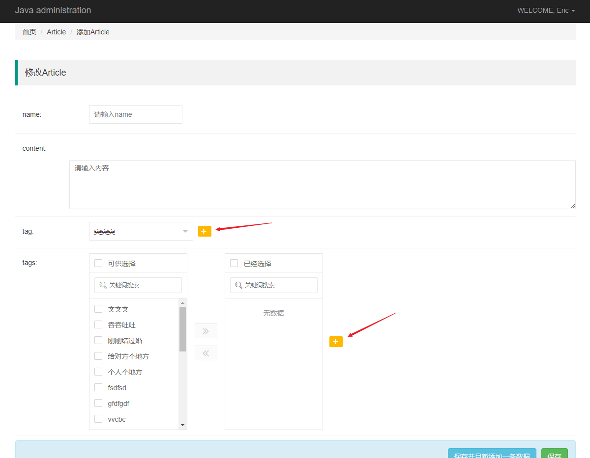
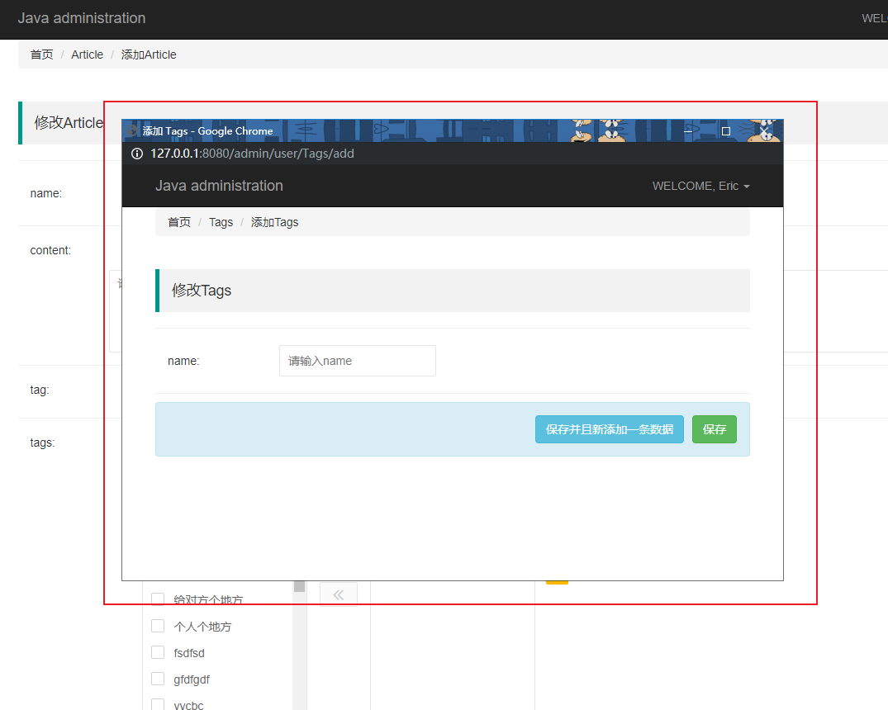
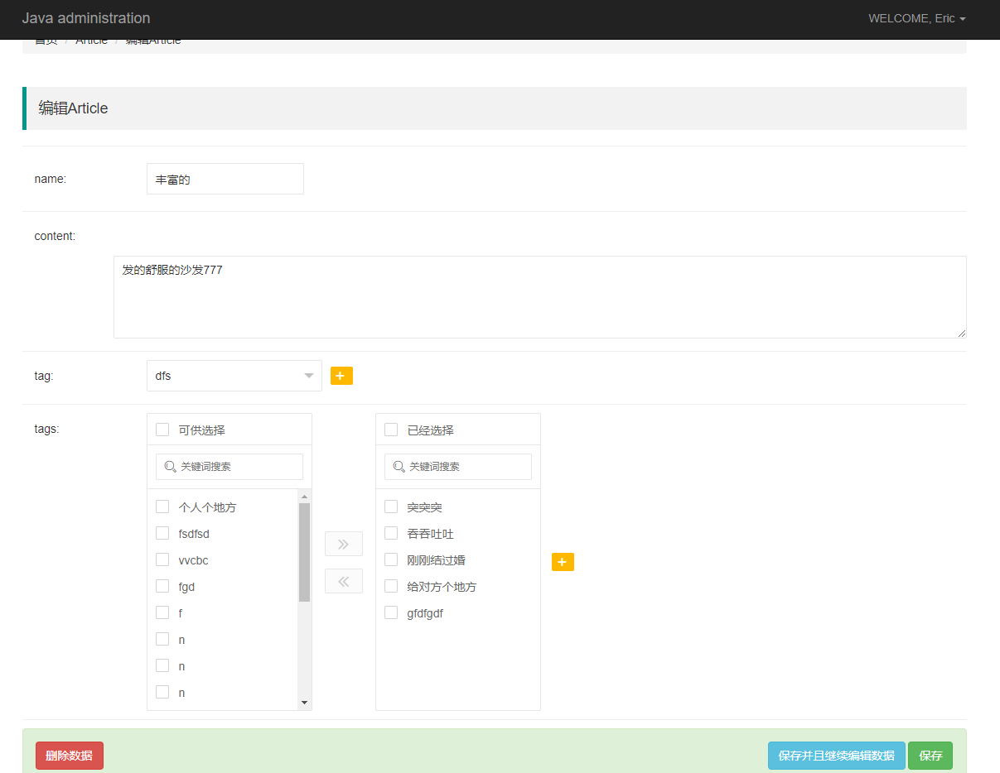
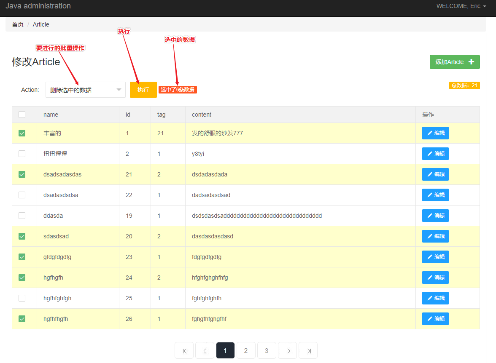
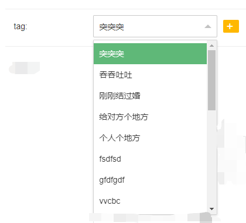

**完美嵌入项目，丢弃沉重的数据库操作软件，启动项目就可以对数据进行增删改查**

Java Admin是一套完备的在线增删改查系统，它舍弃了传统的通过Navicat或者PLSQL等软件操作数据库的方式，而是在项目内部嵌入了Java Admin，通过在网页端操作数据库，类似于Django的admin。

当Java Admin嵌入到项目中后，可以通过Generate类创建超级用户，通过账户跟密码登陆Java Admin，Java Admin使用shiro做用户认证，相对安全。登陆之后可以查看Java Admin的系统表，如果需要控制用户自己的表，需要将对应的实体类在Register类中进行注册，注册之后就可以登陆Java Admin对表进行增删改查的操作。

## 起步

### 1. 填写数据库信息

使用Java Admin第一步需要在`resources/db.properties`文件中写上数据库连接的信息，包括url、user跟pwd

### 2. 生成user表以及账户

想要进入Java Admin页面管理数据表需要登陆，那么首先需要创建账户，账户存储在数据库中，因此需要先创建用户表，具体的创建是在`Generate`类中完成的，`Generate`的位置在`admin`目录的`com.ericjin.javadmin.generate`包下，通过执行类里面的`generateUserTable()`方法来创建用户表。

创建用户表后就需要创建账户了，还是在`Generate`类下，执行`createUser()`方法按照要求填写即可创建账户。

### 3. 登陆Java admin

启动项目后，通过地址`http://127.0.0.1:8080/admin/login`可以进入Java Admin的登陆页面，如下：


### 4. 操作数据表

登陆后会进入首页，首页展示如下：



可以看到，首页有一个Panel，Panel的头部写着系统表，这是Java Admin系统自带的表，可以看到有一张用户表，这张表就是刚刚第二步通过`Generate`类创建的表，里面存储有用户信息，一般不是太会用到。那么如果想要操作自己的表应该怎么做呢？

来到项目中，可以看到一个`Register`类，具体位置在admin目录下的`com.ericjin.javadmin`包下，来到类中可以看到一个`userTableList()`方法，里面会实例化一个List，然后返回出去，如果想要操作自己的表，就需要在该方法中将自己表对应的java实体类的Class对象添加到这个列表中，例如：

```java
public List<Class> userTableList() {
    List<Class> list = new ArrayList<>();
    // 此处添加用户表信息
    list.add(Test.class);
    list.add(Article.class);
    list.add(Tags.class);
    return list;
}
```

在上面的代码中添加了三个实体类，注意添加的实体类一定要在数据库中有对应的表。

重启项目，然后来到首页：


#### 查询数据

可以看到在系统表下面有了一个用户表，里面有三条信息，正是刚刚添加的三个实体类，可以点进去进行查看，例如现在点进`Article`中：


#### 添加数据

点进去后就是关于Article的所有数据了，在这里面可以针对每一条数据进行修改，也可以添加Article，只需要点击绿色的按钮即可，点击后会出现下面的页面：



​	Java Admin会根据`Article`实体类中的所有私有属性进行表单渲染，表单类型会根据属性的类型来选择渲染，或input框，或select框，或radio框，或穿梭框等等。

​	如果在该实体类中有外键关联了其他的实体类，Java Admin会找到所关联的表的所有字段渲染成一个select框供选择，显示外键的属性上面需要标注`@ForeignKey`注解，在注解里面可以配置要显示的字段名以及要保存的外键value。如果是多对多，则会渲染成穿梭框，需要在属性上标注`@ManyToManyField`注解，注解里面的内容后面会详细说明。

​	在上图中可以看到不论是外键还是多对多的旁边都有一个添加按钮，点击这个按钮就可以往对应的关联表的中添加信息，例如上图中点击按钮就可以对tag表进行添加，如下：



在上图中的红框中就是添加tag的页面，填写后保存即可。

#### 修改跟删除数据

再回到数据展示页面，可以看到在每一条数据后面都有一个编辑按钮，点击进入：



可以看到和添加表的页面基本没有差别，只是在每一个输入框中都已经填入了已经保存在数据库中的信息，还有就是在底部添加了一个删除按钮，点击删除就可以对该条数据进行删除，其他都与添加页面的功能保持一致。

#### Action

Action是一个可以对数据进行批量操作的功能，在数据展示页面，选中要批量操作的数据，然后在Action选框中选中要进行何种批量操作，最后点击执行即可。如下：



Java Admin系统只提供了一个批量删除的操作，如果需要实现其他的批量操作，可以在`Action`类中自己定义，关于自定义Action的具体内容会在后面说明。

## Java Admin注解

## 类注解

### EntityTableName

EntityTableName标注在实体类上面，它的作用是标明该实体类对应着数据库中的哪张表，如果不标注，Java Admin会按照实体类名的小写的方式确定表名，例如：`Article`会转换成`article`去数据库查询

### ShowName

这个注解的作用是为实体类重命名，在Java Admin中会按照实体类的名称来显示，如果希望显示自定义的名称，则可以通过该注解来实现。例如，现在在Java Admin中显示的名字是实体类名：


现在在Article类上面标注ShowName注解

```java
@ShowName(name = "文章表")
public class Article {}
```

再次来到首页查看：


可以看到，现在显示的名称已经变成了刚刚在ShowName中注解的名称

## 字段注解

### Id

id注解起初出现的意义是为了屏蔽id字段，因为大多数情况下，id是自增的，因此并不需要自己填写，所以为了避免误填，可以在id字段上面标注`@Id`注解来屏蔽掉该字段，屏蔽后再添加或者修改数据就不会出现添加id的项了。当然这个注解并不仅仅是可以添加在id字段上，还可以添加在任何想要屏蔽的字段上。

### Password

该注解也是用于标注在字段上面的，一般标注在表示密码的字段上，表示在生成input框的时候type=password

### DateUse

该注解的作用与Password注解相似，一般标注在表示日期的字段上面，表示在生成input框的时候生成日期选择的输入框

### Choose

有的时候一些字段只有规定的几个值需要填，例如性别字段就只有男女两个选择，这个时候就可以使用`Choose`注解去规定生成select选择框。它有几个值需要填写：

* type：这个字段用于确定复选框的类型，有0跟1两个选择，默认为0，0表示生成radio框，1表示生成select框；
* valueList：选择框的value值；
* textList：选择框要显示的文字信息；

**type=0**

下面演示type=0的效果，也就是生成radio框

```java
@ShowName(name = "文章表")
public class Article {
	@Choose(valueList = {"0", "1"}, textList = {"男", "女"})
    public Integer gender;
}
```

生成的input框如下：


**type=1**

下面演示type=1的效果，也就是生成select框

```java
@ShowName(name = "文章表")
public class Article {
	@Choose(type = 1, valueList = {"0", "1"}, textList = {"男", "女"})
    public Integer gender;
}
```

生成的input框如下：


### ForeignKey

这个注解标注在表示外键的字段上面，标注该字段后，在添加或者编辑信息的时候会自动加载所关联的表的信息，以供选择。它有几个值需要填写：

* relation_table：这个值需要填写外键关联的表名；
* relation_key：外键关联的表的字段，默认是`id`，这个会作为select框的value值；
* show_field：想要显示关联表的哪一列的内容，这个会作为select框中的option标签体里的内容；
* relation_bean：关联的表对应的实体类；

**示例：**

```java
@ForeignKey(relation_table = "tags", relation_key = "id", show_field = "name", relation_bean = Tags.class)
private Integer tag;
```

生成的表单如下：



### ManyToManyField

这个注解标注在多对多关联的字段上，会显示一个穿梭框，它会自动加载第三张表的信息以供选择。它有几个值需要填写：

* relation_table：关联的表的表名；
* third_table：多对多会出现第三张表，这个字段填写第三张表的表名；
* show_field：想要显示关联表哪一列的内容；
* relation_field：关联表在第三张表中插入的内容，一般是关联表的`id`
* third_relation_field：关联表在第三张表中对应的字段，也就是说该字段是一个外键，关联着关联表的id(默认)
* third_self_field：当前表在第三张表中对应的字段，也就是说该字段是一个外键，关联着当前表的id(默认)
* insert_field：当前表在第三张表中插入的内容，一般是本表的`id`
* relation_bean：当前表关联的表所对应的实体类

**示例：**

```java
@ManyToManyField(relation_table = "tags", third_table = "tag_article", show_field = "name", relation_field = "id",
            third_relation_field = "tag_id", third_self_field = "article_id", relation_bean = Tags.class)
private List tags;
```

生成的穿梭框如下：


# Action

Java Admin还有一个比较重要的功能，就是对数据进行批量处理，在上面已经提到了批量删除一些字段，那么如果想要实现一些其他的批量操作的功能应该怎么办呢？

首先需要在`Action`类中实现批量操作的具体内容，`Action`类在admin目录下的`com.ericjin.javadmin`包里面，该类中已经有了一个批量删除的实现方法，可以在里面写上自己想要实现的批量操纵方法，例如：

```java
public class Action {
    // 自定义批量操作的方法
    public Boolean printSelectedData(List<Integer> selectArr, String tableName, SuperMapper superMapper) {
        selectArr.forEach(System.out::println);
        return true;
    }
}
```

写完该方法后，需要在`Register`类中定义，该类在admin包下面的`com.ericjin.javadmin`包下，这个类在注册用户表的时候也使用到了，在这里面有一个`actionMap()`方法，会返回一个map，在这个方法中，我们需要将自己定义的方法名称跟要显示在批量操作的select框里面的option的内容，现在将刚刚定义的action方法注册进去

```java
/**
 * 想要执行的action
 *
 * @return
 */
public Map<String, String> actionMap() {
    Map<String, String> map = new LinkedHashMap<>();
    // 添加要执行的action
    map.put("deleteSelectData", "删除选中的数据");
    map.put("printSelectedData", "打印所选数据的信息");
    return map;
}
```

现在重启项目来到数据展示页：


现在选中执行：


成功打印所选数据的id信息


 